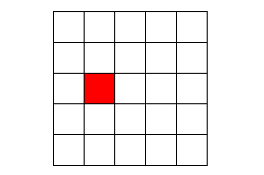
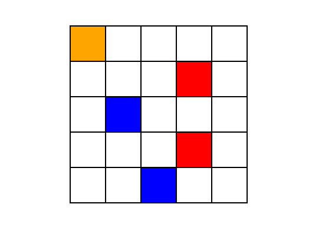

# Glowing Lamp
## A colorful puzzle built with react. 

The board consists of 25 squares:

When you click on one of the squares it changes color:

If you keep clicking, all the old squares change colors also:

Can you figure out the pattern?

See the game in action at [taylnath.github.io/glowing-lamp](http://taylnath.github.io/glowing-lamp).
